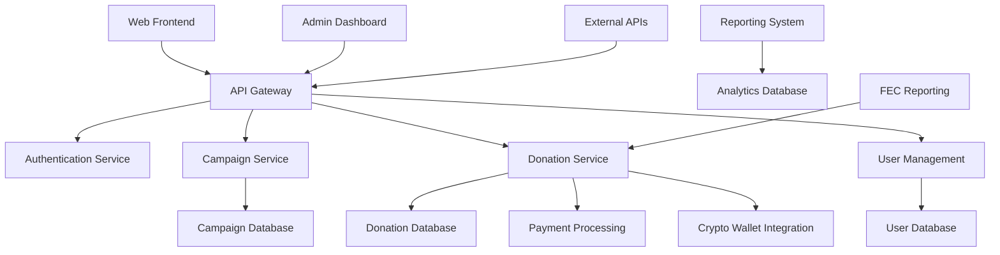
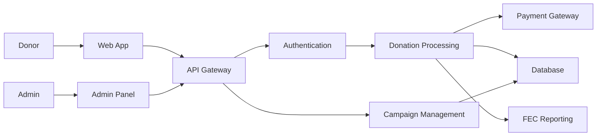

# Threat Model - Crypto Campaign Unified Platform

## Executive Summary

This document presents a comprehensive threat model for the Crypto Campaign Unified platform, a political campaign donation and management system. The threat model identifies potential security threats, attack vectors, and mitigation strategies to protect against various threat actors and scenarios.

## System Overview

### Architecture Components

### Data Flow Diagram

## Threat Identification

### STRIDE Analysis

| Component | Threat Type | Description | Impact | Likelihood | Risk |
|-----------|-------------|-------------|--------|------------|------|
| Web Frontend | Spoofing | Fake donation forms | High | Medium | High |
| API Gateway | Tampering | Request manipulation | High | Medium | High |
| Authentication | Repudiation | Transaction denial | Medium | Low | Low |
| Database | Information Disclosure | Data breach | High | Low | Medium |
| Payment Processing | Denial of Service | Service disruption | Medium | Medium | Medium |
| FEC Reporting | Elevation of Privilege | Unauthorized access | High | Low | Medium |

## Threat Actors

### External Threat Actors

#### 1. Cybercriminals
- **Motivation**: Financial gain through fraud
- **Capabilities**: Moderate to high technical skills
- **Attack Methods**: 
  - Credit card fraud
  - Identity theft
  - Donation manipulation
  - Money laundering
- **Assets Targeted**: Payment systems, donor data, financial records

#### 2. State-Sponsored Actors
- **Motivation**: Political influence, intelligence gathering
- **Capabilities**: Advanced persistent threat (APT) level
- **Attack Methods**:
  - Advanced phishing campaigns
  - Zero-day exploits
  - Supply chain attacks
  - Data exfiltration
- **Assets Targeted**: Voter data, campaign strategies, donor information

#### 3. Political Opponents
- **Motivation**: Competitive advantage, reputation damage
- **Capabilities**: Moderate technical skills, potential insider access
- **Attack Methods**:
  - Social engineering
  - Information warfare
  - Service disruption
  - Data leaks
- **Assets Targeted**: Campaign data, donor lists, strategic information

#### 4. Hacktivists
- **Motivation**: Political ideology, social causes
- **Capabilities**: Moderate technical skills, coordinated groups
- **Attack Methods**:
  - DDoS attacks
  - Website defacement
  - Data breaches
  - Public exposure
- **Assets Targeted**: Public-facing systems, sensitive data

### Internal Threat Actors

#### 1. Malicious Insiders
- **Motivation**: Financial gain, political ideology, personal grievances
- **Capabilities**: Privileged access, system knowledge
- **Attack Methods**:
  - Data theft
  - System sabotage
  - Unauthorized transactions
  - Information leakage
- **Assets Targeted**: All system components and data

#### 2. Negligent Employees
- **Motivation**: Unintentional security violations
- **Capabilities**: Authorized access, limited security awareness
- **Attack Methods**:
  - Phishing susceptibility
  - Weak password practices
  - Accidental data exposure
  - Social engineering vulnerability
- **Assets Targeted**: User credentials, sensitive data

## Attack Scenarios

### Scenario 1: Donation Fraud Campaign

**Attack Vector**: Coordinated credit card fraud using stolen payment information

**Attack Steps**:
1. Threat actor obtains stolen credit card data from underground markets
2. Creates multiple fake donor identities with valid personal information
3. Attempts small donations ($5-$50) to avoid detection thresholds
4. Uses bot networks to automate donation process across multiple campaigns
5. Exploits weak fraud detection to process thousands of fraudulent donations
6. Real cardholders dispute charges, causing chargebacks and financial losses

**Impact**: 
- Financial losses from chargebacks
- Legal liability for processing fraudulent transactions
- Reputation damage
- FEC compliance violations

**Existing Controls**:
- Payment processor fraud detection
- Basic input validation
- Rate limiting on donation endpoints

**Residual Risk**: MEDIUM

**Additional Mitigations Needed**:
- Advanced behavioral analytics for fraud detection
- Enhanced KYC procedures for large donations
- Real-time transaction monitoring
- Machine learning-based anomaly detection

### Scenario 2: Regulatory Compliance Attack

**Attack Vector**: Manipulation of donation systems to violate FEC regulations

**Attack Steps**:
1. Threat actor researches FEC contribution limits and reporting requirements
2. Creates straw donor scheme using multiple identities to exceed individual limits
3. Coordinates donations to appear legitimate while violating aggregate limits
4. Exploits weaknesses in donor information validation
5. Times donations to avoid detection during reporting periods
6. Causes campaign to unknowingly violate FEC regulations

**Impact**:
- Regulatory fines and penalties
- Campaign disqualification
- Legal liability for campaign officials
- Public trust damage

**Existing Controls**:
- Contribution limit enforcement
- Donor information collection
- Basic duplicate detection

**Residual Risk**: MEDIUM

**Additional Mitigations Needed**:
- Advanced pattern recognition for straw donor detection
- Real-time FEC compliance monitoring
- Enhanced donor verification procedures
- Automated suspicious activity reporting

### Scenario 3: Data Breach and Identity Theft

**Attack Vector**: SQL injection leading to database compromise

**Attack Steps**:
1. Attacker identifies vulnerable input field lacking proper sanitization
2. Crafts SQL injection payload to bypass authentication
3. Escalates privileges within database system
4. Extracts complete donor database including PII and payment information
5. Sells data on dark web marketplaces
6. Victims experience identity theft and financial fraud

**Impact**:
- Massive privacy violation affecting thousands of donors
- Legal liability under GDPR and state privacy laws
- Identity theft affecting donor community
- Catastrophic reputation damage
- Regulatory investigations and fines

**Existing Controls**:
- Parameterized queries in most locations
- Input validation frameworks
- Database access controls
- Encryption at rest

**Residual Risk**: LOW (with current protections)

**Additional Mitigations Needed**:
- Comprehensive code security review
- Web application firewall (WAF)
- Database activity monitoring
- Enhanced data classification and handling procedures

### Scenario 4: Smart Contract Exploitation

**Attack Vector**: Reentrancy attack on cryptocurrency donation contract

**Attack Steps**:
1. Attacker analyzes smart contract code for vulnerabilities
2. Identifies reentrancy vulnerability in withdrawal function
3. Creates malicious contract that calls back into vulnerable function
4. Deposits minimal amount to establish legitimate balance
5. Triggers reentrancy attack to drain contract funds
6. Converts stolen cryptocurrency and disappears

**Impact**:
- Complete loss of cryptocurrency donations held in contract
- Financial losses potentially in millions of dollars
- Destruction of donor trust in cryptocurrency donations
- Negative impact on blockchain adoption for political campaigns

**Existing Controls**:
- Reentrancy guards in critical functions
- Checks-effects-interactions pattern
- Multi-signature requirements for large withdrawals

**Residual Risk**: LOW (with current protections)

**Additional Mitigations Needed**:
- Formal verification of critical smart contract functions
- Bug bounty program for contract auditing
- Time delays for large withdrawals
- Emergency pause functionality

### Scenario 5: Social Engineering and Insider Threat

**Attack Vector**: Spear phishing campaign targeting privileged users

**Attack Steps**:
1. Attacker researches campaign staff through social media and public records
2. Crafts convincing spear phishing emails impersonating trusted entities
3. Successfully compromises campaign manager's credentials
4. Uses legitimate access to modify donation processing rules
5. Redirects portion of donations to attacker-controlled accounts
6. Maintains persistence for extended period before detection

**Impact**:
- Financial theft through fraudulent redirections
- Compromise of sensitive campaign strategy information
- Unauthorized access to donor personal information
- Potential for ongoing espionage activities

**Existing Controls**:
- Basic security awareness training
- Multi-factor authentication for admin accounts
- Role-based access controls

**Residual Risk**: MEDIUM

**Additional Mitigations Needed**:
- Advanced phishing simulation training
- Behavioral analytics for insider threat detection
- Privileged access management (PAM) solution
- Regular access reviews and certification

## Risk Assessment Matrix

| Threat Scenario | Likelihood | Impact | Risk Level | Priority |
|----------------|------------|--------|------------|----------|
| Donation Fraud | Medium | High | High | 1 |
| Regulatory Compliance | Medium | High | High | 2 |
| Social Engineering | Medium | Medium | Medium | 3 |
| Data Breach | Low | High | Medium | 4 |
| Smart Contract Exploit | Low | High | Medium | 5 |
| DDoS Attack | High | Medium | Medium | 6 |
| Insider Threat | Low | Medium | Low | 7 |
| Supply Chain Compromise | Low | Medium | Low | 8 |

## Security Controls Mapping

### Preventive Controls

#### Authentication and Access Control
- Multi-factor authentication for all administrative accounts
- Role-based access control (RBAC) with principle of least privilege
- Strong password policies and regular rotation
- Account lockout policies for failed authentication attempts
- Session management with secure tokens and timeout

#### Input Validation and Output Encoding
- Comprehensive input sanitization for all user inputs
- Parameterized queries to prevent SQL injection
- Output encoding to prevent XSS attacks
- File upload validation and sandboxing
- API rate limiting and request size restrictions

#### Network Security
- Web Application Firewall (WAF) with custom rules
- Network segmentation and micro-segmentation
- Intrusion Prevention System (IPS) deployment
- SSL/TLS encryption for all communications
- Certificate pinning for critical connections

#### Data Protection
- Encryption at rest using AES-256 for all sensitive data
- Encryption in transit using TLS 1.3 minimum
- Data classification and handling procedures
- Privacy-preserving data processing techniques
- Secure key management and rotation

### Detective Controls

#### Monitoring and Logging
- Security Information and Event Management (SIEM) system
- Real-time fraud detection and alerting
- Database activity monitoring
- Network traffic analysis
- User behavior analytics (UBA)

#### Vulnerability Management
- Automated vulnerability scanning
- Regular penetration testing
- Static and dynamic application security testing
- Dependency vulnerability monitoring
- Configuration compliance monitoring

#### Incident Detection
- Security Operations Center (SOC) with 24/7 monitoring
- Automated threat intelligence integration
- Anomaly detection using machine learning
- Honeypots and deception technology
- File integrity monitoring

### Responsive Controls

#### Incident Response
- Comprehensive incident response plan
- Automated incident containment procedures
- Forensic investigation capabilities
- Communication and notification procedures
- Recovery and restoration processes

#### Business Continuity
- Disaster recovery planning and testing
- High availability architecture design
- Data backup and restoration procedures
- Alternative processing capabilities
- Crisis communication plans

## Compliance Requirements

### Federal Election Commission (FEC)
- Contribution limit enforcement (individual: $2,900 per election)
- Donor information collection for contributions > $200
- Prohibited contributor screening (foreign nationals, corporations, etc.)
- Reporting and recordkeeping requirements
- Disclaimer requirements for solicitations

### Payment Card Industry (PCI DSS)
- Secure cardholder data handling
- Encryption of card data in transit and at rest
- Access controls and authentication
- Regular security testing and monitoring
- Incident response procedures

### General Data Protection Regulation (GDPR)
- Lawful basis for data processing
- Data minimization and purpose limitation
- Data subject rights implementation
- Privacy by design principles
- Data breach notification procedures

### Anti-Money Laundering (AML)
- Know Your Customer (KYC) procedures
- Suspicious activity monitoring and reporting
- Customer due diligence requirements
- Record keeping and audit trails
- Employee training and awareness

## Recommended Security Controls

### Immediate (0-30 days)

#### High Priority
1. **Advanced Fraud Detection System**
   - Implement machine learning-based fraud detection
   - Real-time transaction monitoring and scoring
   - Behavioral analytics for donation patterns
   - Integration with external fraud databases

2. **Enhanced Authentication**
   - Mandatory MFA for all administrative accounts
   - Risk-based authentication for high-value transactions
   - Device fingerprinting and trusted device management
   - Session management improvements

3. **Network Security Hardening**
   - Close non-essential ports and services
   - Implement network segmentation
   - Deploy Web Application Firewall (WAF)
   - Enable DDoS protection services

#### Medium Priority
4. **Security Monitoring Enhancement**
   - Deploy SIEM solution with custom rules
   - Implement user behavior analytics
   - Set up automated alerting for security events
   - Create security dashboard for real-time monitoring

5. **Vulnerability Management Program**
   - Automated vulnerability scanning schedule
   - Regular penetration testing program
   - Bug bounty program for external security testing
   - Security code review processes

### Short-term (30-90 days)

#### High Priority
6. **Compliance Automation**
   - Automated FEC compliance monitoring
   - Real-time contribution limit enforcement
   - Enhanced donor verification procedures
   - Automated suspicious activity reporting

7. **Smart Contract Security**
   - Formal verification of critical functions
   - Time-locked withdrawals for large amounts
   - Multi-signature wallet requirements
   - Emergency pause functionality

#### Medium Priority
8. **Data Protection Enhancement**
   - Implement data loss prevention (DLP)
   - Enhanced encryption key management
   - Privacy-preserving analytics techniques
   - Data retention and disposal automation

9. **Incident Response Capabilities**
   - 24/7 Security Operations Center (SOC)
   - Automated incident response playbooks
   - Forensic investigation tools and procedures
   - Crisis communication systems

### Long-term (90+ days)

#### Strategic Initiatives
10. **Zero Trust Architecture**
    - Identity-centric security model
    - Micro-segmentation implementation
    - Continuous verification and monitoring
    - Software-defined perimeter (SDP)

11. **Advanced Threat Detection**
    - AI-powered threat hunting capabilities
    - Deception technology deployment
    - Threat intelligence platform integration
    - Predictive analytics for threat forecasting

12. **Security Culture Program**
    - Comprehensive security awareness training
    - Phishing simulation and testing
    - Security champions program
    - Regular security culture assessments

## Metrics and KPIs

### Security Metrics

1. **Preventive Metrics**
   - Percentage of systems with current security patches
   - Number of failed authentication attempts blocked
   - Percentage of transactions passing fraud detection
   - Compliance score percentage

2. **Detective Metrics**
   - Mean time to detection (MTTD) for security incidents
   - Number of security events generated and investigated
   - False positive rate for security alerts
   - Coverage percentage for security monitoring

3. **Responsive Metrics**
   - Mean time to response (MTTR) for security incidents
   - Percentage of incidents contained within SLA
   - Number of successful incident response exercises
   - Recovery time objective (RTO) achievement

### Business Metrics

1. **Financial Impact**
   - Fraud losses as percentage of total donations
   - Cost savings from prevented fraud attempts
   - Compliance fine avoidance
   - Security investment ROI

2. **Operational Efficiency**
   - Donation processing success rate
   - System availability percentage
   - User satisfaction scores
   - Compliance audit success rate

## Conclusion

This threat model provides a comprehensive analysis of security risks facing the Crypto Campaign Unified platform. The identified threats range from financial fraud and regulatory compliance violations to sophisticated nation-state attacks and insider threats.

The recommended security controls are prioritized based on risk assessment and business impact. Implementing these controls will significantly improve the security posture of the platform and protect against the identified threats.

Regular updates to this threat model should be performed as the system evolves, new threats emerge, and the threat landscape changes. The threat model should be reviewed quarterly and updated based on new intelligence, incidents, and system changes.

### Next Steps

1. **Executive Review**: Present threat model to executive leadership for approval and resource allocation
2. **Implementation Planning**: Create detailed implementation plans for recommended security controls
3. **Risk Acceptance**: Formally document accepted risks and compensating controls
4. **Monitoring Setup**: Implement metrics collection and reporting mechanisms
5. **Regular Reviews**: Schedule quarterly threat model reviews and updates

This threat model serves as the foundation for building a robust security program that protects the platform, its users, and the democratic process it supports.